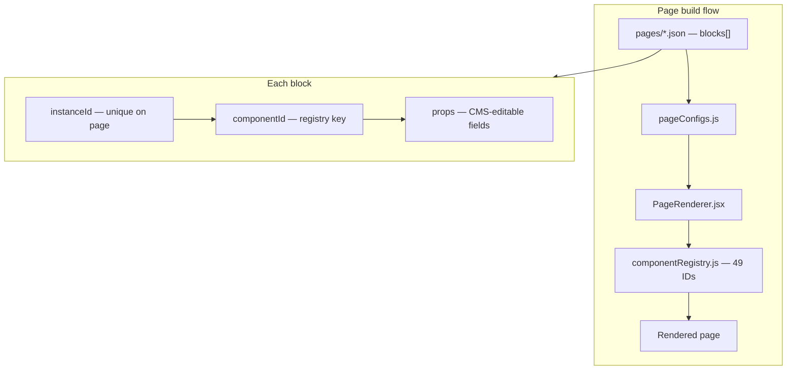

# NFCI CMS — All 49 Component IDs

Source of truth for IDs: `componentIds.js` · Registry: `componentRegistry.js` · Programmatic flow: `componentsFlow.js`

---

## Page build flow



| Step | Action        | Detail                                                  |
| ---- | ------------- | ------------------------------------------------------- |
| 1    | `LOAD_CONFIG` | `getPageConfig('home')` → `pages/home.json`             |
| 2    | `SORT_BLOCKS` | Sort `blocks` by `order`                                |
| 3    | `RESOLVE_ID`  | `componentRegistry[componentId]` → React component      |
| 4    | `RENDER`      | `<Component key={instanceId} {...props} />`             |
| 5    | `FOOTER`      | Global `Footer` in `App.jsx` (optional block: `footer`) |

---

## Registry overview (49 components)

```mermaid
flowchart TB
  REG["componentRegistry.js"]

  subgraph navigation["navigation — 3"]
    navbar
    about-navbar
    footer
  end

  subgraph hero["hero — 7"]
    hero
    about-hero
    placement-hero
    career-beauty-hero
    events-hero
    blog-hero
    blog-hero-banner
  end

  subgraph content["content — 18"]
    stats
    about
    our-company
    why-choose-us
    why-choose-about
    programs-slider
    courses-slider
    affiliations
    expertise
    top-employers
    video-section
    testimonials
    articles
    faq
    contact
    nfci-history
    about-team
    training-partners
  end

  subgraph events["events — 10"]
    partners-logo-grid
    future-leaders-event
    upcoming-events
    featured-event-banner
    event-page-team
    event-stats
    recent-events
    related-events
    about-event-gallery
    featured-music-festival
  end

  subgraph blog["blog — 4"]
    blog-card-section
    recent-posts
    related-posts
    blog-detail-content
  end

  subgraph courses["courses — 7"]
    explore-courses
    reasons-section
    what-will-you-learn
    indian-tandoori-gallery
    certificate-tandoor
    indian-cooking-eligibility
    indian-cuisine-course-details
  end

  REG --> navigation
  REG --> hero
  REG --> content
  REG --> events
  REG --> blog
  REG --> courses
```

---

## Master table (all 49)

| #   | componentId                     | Label                         | File                               | Category   | Constant                        |
| --- | ------------------------------- | ----------------------------- | ---------------------------------- | ---------- | ------------------------------- |
| 1   | `navbar`                        | Navbar                        | Navbar.jsx                         | navigation | `NAVBAR`                        |
| 2   | `about-navbar`                  | About Navbar                  | AboutNavbar.jsx                    | navigation | `ABOUT_NAVBAR`                  |
| 3   | `footer`                        | Footer                        | Footer.jsx                         | navigation | `FOOTER`                        |
| 4   | `hero`                          | Hero                          | Hero.jsx                           | hero       | `HERO`                          |
| 5   | `about-hero`                    | About Hero                    | AboutHero.jsx                      | hero       | `ABOUT_HERO`                    |
| 6   | `placement-hero`                | Placement Hero                | PlacementHero.jsx                  | hero       | `PLACEMENT_HERO`                |
| 7   | `career-beauty-hero`            | Career Beauty Course Hero     | CareerBeautyCourseHero.jsx         | hero       | `CAREER_BEAUTY_HERO`            |
| 8   | `events-hero`                   | Events Hero                   | EventsHeroSection.jsx              | hero       | `EVENTS_HERO`                   |
| 9   | `blog-hero`                     | Blog Hero                     | BlogHero.jsx                       | hero       | `BLOG_HERO`                     |
| 10  | `blog-hero-banner`              | Blog Hero Banner              | BlogHeroBanner.jsx                 | hero       | `BLOG_HERO_BANNER`              |
| 11  | `stats`                         | Stats                         | Stats.jsx                          | content    | `STATS`                         |
| 12  | `about`                         | About                         | About.jsx                          | content    | `ABOUT`                         |
| 13  | `our-company`                   | Our Company                   | OurCompany.jsx                     | content    | `OUR_COMPANY`                   |
| 14  | `why-choose-us`                 | Why Choose Us                 | WhyChooseUs.jsx                    | content    | `WHY_CHOOSE_US`                 |
| 15  | `why-choose-about`              | Why Choose About              | WhyChooseAbout.jsx                 | content    | `WHY_CHOOSE_ABOUT`              |
| 16  | `programs-slider`               | Programs Slider               | ProgramsSlider.jsx                 | content    | `PROGRAMS_SLIDER`               |
| 17  | `courses-slider`                | Courses Slider                | CoursesSlider.jsx                  | content    | `COURSES_SLIDER`                |
| 18  | `affiliations`                  | Affiliations                  | Affiliations.jsx                   | content    | `AFFILIATIONS`                  |
| 19  | `expertise`                     | Expertise                     | Expertise.jsx                      | content    | `EXPERTISE`                     |
| 20  | `top-employers`                 | Top Employers                 | TopEmployers.jsx                   | content    | `TOP_EMPLOYERS`                 |
| 21  | `video-section`                 | Video Section                 | VideoSection.jsx                   | content    | `VIDEO_SECTION`                 |
| 22  | `testimonials`                  | Testimonials                  | Testimonials.jsx                   | content    | `TESTIMONIALS`                  |
| 23  | `articles`                      | Articles                      | Articles.jsx                       | content    | `ARTICLES`                      |
| 24  | `faq`                           | FAQ                           | FAQ.jsx                            | content    | `FAQ`                           |
| 25  | `contact`                       | Contact                       | Contact.jsx                        | content    | `CONTACT`                       |
| 26  | `nfci-history`                  | NFCI History                  | NFCIHistory.jsx                    | content    | `NFCI_HISTORY`                  |
| 27  | `about-team`                    | About Team                    | AboutTeam.jsx                      | content    | `ABOUT_TEAM`                    |
| 28  | `training-partners`             | Training Partners             | TrainingPartners.jsx               | content    | `TRAINING_PARTNERS`             |
| 29  | `partners-logo-grid`            | Partners Logo Grid            | PartnersLogoGridSection.jsx        | events     | `PARTNERS_LOGO_GRID`            |
| 30  | `future-leaders-event`          | Future Leaders Event          | FutureLeadersEventSection.jsx      | events     | `FUTURE_LEADERS_EVENT`          |
| 31  | `upcoming-events`               | Upcoming Events               | UpcomingEventsSection.jsx          | events     | `UPCOMING_EVENTS`               |
| 32  | `featured-event-banner`         | Featured Event Banner         | FeaturedEventBanner.jsx            | events     | `FEATURED_EVENT_BANNER`         |
| 33  | `event-page-team`               | Event Page Team               | EventPageTeam.jsx                  | events     | `EVENT_PAGE_TEAM`               |
| 34  | `event-stats`                   | Event Stats                   | EventStatsSection.jsx              | events     | `EVENT_STATS`                   |
| 35  | `recent-events`                 | Recent Events                 | RecentEventsSection.jsx            | events     | `RECENT_EVENTS`                 |
| 36  | `related-events`                | Related Events                | RelatedEventsSection.jsx           | events     | `RELATED_EVENTS`                |
| 37  | `about-event-gallery`           | About Event Gallery           | AboutEventGallerySection.jsx       | events     | `ABOUT_EVENT_GALLERY`           |
| 38  | `featured-music-festival`       | Featured Music Festival       | FeaturedMusicFestivalSection.jsx   | events     | `FEATURED_MUSIC_FESTIVAL`       |
| 39  | `blog-card-section`             | Blog Card Section             | BlogCardSection.jsx                | blog       | `BLOG_CARD_SECTION`             |
| 40  | `recent-posts`                  | Recent Posts                  | RecentPostsSection.jsx             | blog       | `RECENT_POSTS`                  |
| 41  | `related-posts`                 | Related Posts                 | RelatedPosts.jsx                   | blog       | `RELATED_POSTS`                 |
| 42  | `blog-detail-content`           | Blog Detail Content           | BlogDetailscontent.jsx             | blog       | `BLOG_DETAIL_CONTENT`           |
| 43  | `explore-courses`               | Explore Courses               | ExploreCoursesSection.jsx          | courses    | `EXPLORE_COURSES`               |
| 44  | `reasons-section`               | Reasons Section               | ReasonsSection.jsx                 | courses    | `REASONS_SECTION`               |
| 45  | `what-will-you-learn`           | What Will You Learn           | WhatWillYouLearnSection.jsx        | courses    | `WHAT_WILL_YOU_LEARN`           |
| 46  | `indian-tandoori-gallery`       | Indian Tandoori Gallery       | IndianTandooriGallerySection.jsx   | courses    | `INDIAN_TANDOORI_GALLERY`       |
| 47  | `certificate-tandoor`           | Certificate Tandoor           | CertificateTandoorSection.jsx      | courses    | `CERTIFICATE_TANDOOR`           |
| 48  | `indian-cooking-eligibility`    | Indian Cooking Eligibility    | IndianCookingCourseEligibility.jsx | courses    | `INDIAN_COOKING_ELIGIBILITY`    |
| 49  | `indian-cuisine-course-details` | Indian Cuisine Course Details | IndianCuisineCourseDetails.jsx     | courses    | `INDIAN_CUISINE_COURSE_DETAILS` |

---

## Tables by category

### navigation (3)

| componentId    | Label        | File            |
| -------------- | ------------ | --------------- |
| `navbar`       | Navbar       | Navbar.jsx      |
| `about-navbar` | About Navbar | AboutNavbar.jsx |
| `footer`       | Footer       | Footer.jsx      |

### hero (7)

| componentId          | Label                     | File                       |
| -------------------- | ------------------------- | -------------------------- |
| `hero`               | Hero                      | Hero.jsx                   |
| `about-hero`         | About Hero                | AboutHero.jsx              |
| `placement-hero`     | Placement Hero            | PlacementHero.jsx          |
| `career-beauty-hero` | Career Beauty Course Hero | CareerBeautyCourseHero.jsx |
| `events-hero`        | Events Hero               | EventsHeroSection.jsx      |
| `blog-hero`          | Blog Hero                 | BlogHero.jsx               |
| `blog-hero-banner`   | Blog Hero Banner          | BlogHeroBanner.jsx         |

### content (18)

| componentId         | Label             | File                 |
| ------------------- | ----------------- | -------------------- |
| `stats`             | Stats             | Stats.jsx            |
| `about`             | About             | About.jsx            |
| `our-company`       | Our Company       | OurCompany.jsx       |
| `why-choose-us`     | Why Choose Us     | WhyChooseUs.jsx      |
| `why-choose-about`  | Why Choose About  | WhyChooseAbout.jsx   |
| `programs-slider`   | Programs Slider   | ProgramsSlider.jsx   |
| `courses-slider`    | Courses Slider    | CoursesSlider.jsx    |
| `affiliations`      | Affiliations      | Affiliations.jsx     |
| `expertise`         | Expertise         | Expertise.jsx        |
| `top-employers`     | Top Employers     | TopEmployers.jsx     |
| `video-section`     | Video Section     | VideoSection.jsx     |
| `testimonials`      | Testimonials      | Testimonials.jsx     |
| `articles`          | Articles          | Articles.jsx         |
| `faq`               | FAQ               | FAQ.jsx              |
| `contact`           | Contact           | Contact.jsx          |
| `nfci-history`      | NFCI History      | NFCIHistory.jsx      |
| `about-team`        | About Team        | AboutTeam.jsx        |
| `training-partners` | Training Partners | TrainingPartners.jsx |

### events (10)

| componentId               | Label                   | File                             |
| ------------------------- | ----------------------- | -------------------------------- |
| `partners-logo-grid`      | Partners Logo Grid      | PartnersLogoGridSection.jsx      |
| `future-leaders-event`    | Future Leaders Event    | FutureLeadersEventSection.jsx    |
| `upcoming-events`         | Upcoming Events         | UpcomingEventsSection.jsx        |
| `featured-event-banner`   | Featured Event Banner   | FeaturedEventBanner.jsx          |
| `event-page-team`         | Event Page Team         | EventPageTeam.jsx                |
| `event-stats`             | Event Stats             | EventStatsSection.jsx            |
| `recent-events`           | Recent Events           | RecentEventsSection.jsx          |
| `related-events`          | Related Events          | RelatedEventsSection.jsx         |
| `about-event-gallery`     | About Event Gallery     | AboutEventGallerySection.jsx     |
| `featured-music-festival` | Featured Music Festival | FeaturedMusicFestivalSection.jsx |

### blog (4)

| componentId           | Label               | File                   |
| --------------------- | ------------------- | ---------------------- |
| `blog-card-section`   | Blog Card Section   | BlogCardSection.jsx    |
| `recent-posts`        | Recent Posts        | RecentPostsSection.jsx |
| `related-posts`       | Related Posts       | RelatedPosts.jsx       |
| `blog-detail-content` | Blog Detail Content | BlogDetailscontent.jsx |

### courses (7)

| componentId                     | Label                         | File                               |
| ------------------------------- | ----------------------------- | ---------------------------------- |
| `explore-courses`               | Explore Courses               | ExploreCoursesSection.jsx          |
| `reasons-section`               | Reasons Section               | ReasonsSection.jsx                 |
| `what-will-you-learn`           | What Will You Learn           | WhatWillYouLearnSection.jsx        |
| `indian-tandoori-gallery`       | Indian Tandoori Gallery       | IndianTandooriGallerySection.jsx   |
| `certificate-tandoor`           | Certificate Tandoor           | CertificateTandoorSection.jsx      |
| `indian-cooking-eligibility`    | Indian Cooking Eligibility    | IndianCookingCourseEligibility.jsx |
| `indian-cuisine-course-details` | Indian Cuisine Course Details | IndianCuisineCourseDetails.jsx     |

---

## Example block in page JSON

```json
{
  "instanceId": "home-hero",
  "componentId": "hero",
  "order": 2,
  "props": {}
}
```

## Import in code

```js
import { COMPONENT_IDS } from "./componentIds";
import COMPONENTS_FLOW from "./componentsFlow";

console.log(COMPONENTS_FLOW.count); // 49
console.log(COMPONENTS_FLOW.tables.all);
```
